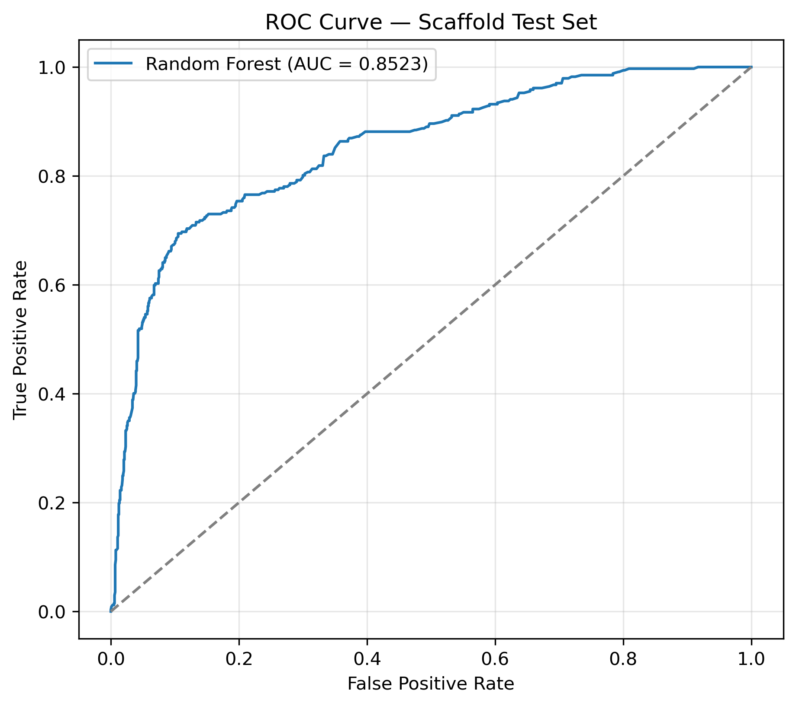
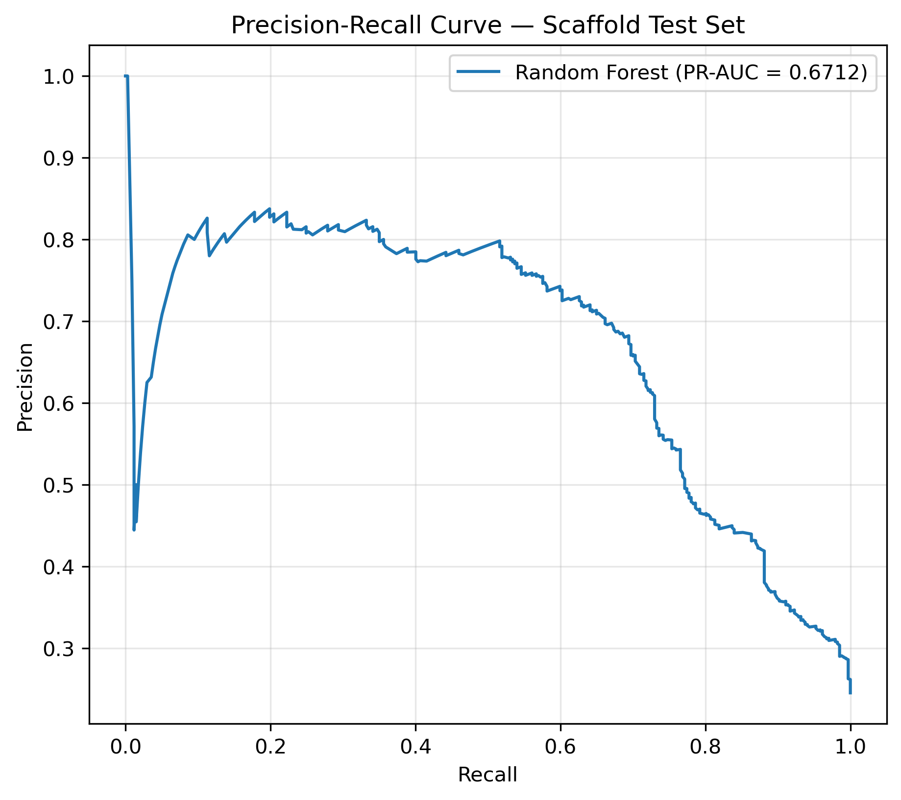
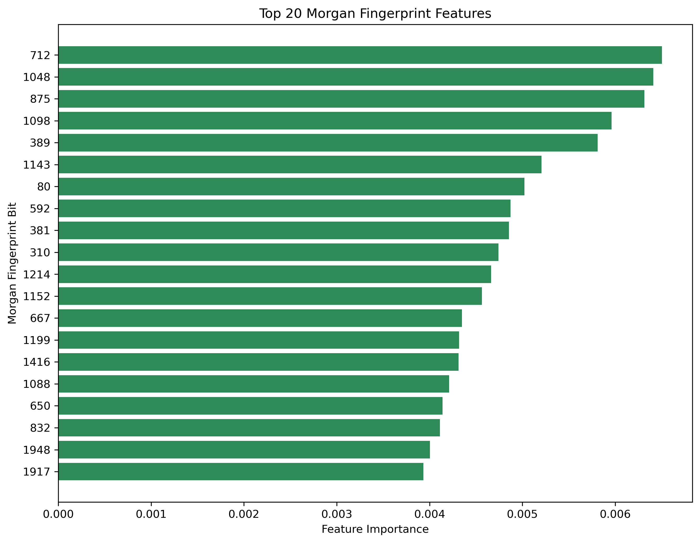

# AChE Inhibitor Prediction Using Machine Learning and Molecular Docking

A computational drug-discovery pipeline for identifying potential inhibitors of human Acetylcholinesterase (AChE), combining **machine learning**, **molecular docking**, **protein–ligand interaction analysis**, and **ADMET profiling**.

---

## Abstract

This project presents an end-to-end computational workflow to prioritize potential AChE inhibitors for Alzheimer's disease therapy. A Random Forest classifier was trained on 6,870 compounds (1,510 active, 5,360 inactive) using Morgan fingerprints (radius 2, 2048 bits) with scaffold-based validation. The model achieved a ROC-AUC of 0.85 on the scaffold test set. Top predicted actives were docked against AChE (PDB: 4EY7) using PyRx, followed by 2D interaction analysis with BIOVIA Discovery Studio. The final lead candidate, CHEMBL206093, showed favorable docking score (−7.6 kcal/mol) and acceptable ADMET properties.

---

## 1. Target

| Property | Value |
|----------|-------|
| Protein | Human Acetylcholinesterase (AChE) |
| PDB ID | [4EY7](https://www.rcsb.org/structure/4EY7) |
| Therapeutic area | Alzheimer's disease |
| Binding pocket | CASTp-identified pocket |

---

## 2. Machine Learning Pipeline

Experimental compound activity data were obtained from **BindingDB**.

1. Data preprocessing and cleaning
2. **Morgan fingerprints** (2048 bits, radius 2) via RDKit
3. **Scaffold-based train/test split** (no scaffold leakage)
4. **SMOTE** oversampling — applied to training data only
5. **Random Forest** classification with GridSearchCV tuning
6. Threshold tuning using out-of-fold predictions

### Model Performance (Scaffold Test Set)

| Metric | Value |
|--------|-------|
| Accuracy | 0.8501 |
| Precision | 0.7382 |
| Recall | 0.6024 |
| F1-score | 0.6634 |
| MCC | 0.5731 |
| ROC-AUC | 0.8523 |
| PR-AUC | 0.6712 |
| Decision threshold | 0.60 |

### Results

**ROC Curve**


**Precision-Recall Curve**


**Top 20 Morgan Fingerprint Features**


Complete workflow: [`01_model_training.ipynb`](01_model_training.ipynb)

---

## 3. Molecular Docking

**Receptor preparation:**
- AChE structure (PDB: 4EY7) obtained from the Protein Data Bank
- Structure prepared with **UCSF ChimeraX** (chain selection, water handling)
- Binding pocket identified using **CASTp**

**Docking:**
- Software: **PyRx**
- Results: [`AChE_docking_results.csv`](AChE_docking_results.csv)

### Top 6 Docking Candidates

| Rank | Compound | Binding Affinity (kcal/mol) |
|------|----------|----------------------------|
| 1 | CHEMBL4524111 | −8.9 |
| 2 | CHEMBL205940 | −8.8 |
| 3 | CHEMBL1677 | −8.7 |
| 4 | CHEMBL609150 | −7.7 |
| 5 | CHEMBL206093 | −7.6 |
| 6 | CHEMBL207777 | −7.5 |

**Pocket residues analyzed:** Glu81, Gly82, Met85, Asp131, Val132, Ala434, Thr436, Leu437, Ser438, Trp439, Tyr449, Glu452, Ile457, Arg463, Asn464, Tyr465.

---

## 4. Protein–Ligand Interaction Analysis

2D protein–ligand interaction diagrams were generated using **BIOVIA Discovery Studio Visualizer** to evaluate:

- Hydrogen bonding with catalytic residues
- π–π stacking interactions
- Hydrophobic contacts within the binding pocket

Only the **top-ranked compound (CHEMBL206093)** was retained for final analysis based on its docking score, interaction profile, and subsequent ADMET evaluation.

---

## 5. Final Candidate

| Property | Value |
|----------|-------|
| ChEMBL ID | CHEMBL206093 |
| PubChem CID | [11681391](https://pubchem.ncbi.nlm.nih.gov/compound/11681391) |
| Docking score | −7.6 kcal/mol |

---

## 6. ADMET Profiling (KCSM Predictions)

| Parameter | Prediction |
|-----------|-----------|
| Intestinal absorption | 91.54% |
| P-gp substrate | No |
| AMES toxicity | No |
| hERG I inhibitor | No |
| hERG II inhibitor | Yes |
| Hepatotoxicity | Yes |
| CYP3A4 substrate | Yes |
| CYP1A2 inhibitor | Yes |
| CYP2C19 inhibitor | Yes |
| CYP2C9 inhibitor | Yes |
| CYP3A4 inhibitor | Yes |

**Interpretation:** Favorable absorption (91.5%), not AMES-mutagenic, not a P-gp substrate. However, hERG II inhibition and hepatotoxicity flags require experimental validation. Multiple CYP450 inhibitions suggest possible drug–drug interaction risk.

---

## 7. Workflow

```
BindingDB data → Preprocessing → Morgan fingerprints → Random Forest
→ Candidate screening → CASTp pocket identification → PyRx docking
→ Discovery Studio interaction analysis → Shortlisting → KCSM ADMET
→ Final candidate (CHEMBL206093)
```

---

## 8. Repository Contents

| File | Description |
|------|-------------|
| `01_model_training.ipynb` | Complete ML workflow |
| `AChE_final_scaffold_results.csv` | Final model performance |
| `AChE_docking_results.csv` | Molecular docking results |
| `AChE_Final_RF_model.pkl.gz` | Trained Random Forest model (compressed) |
| `predict.py` | Command-line prediction script |
| `requirements.txt` | Python dependencies |
| `roc_curve.png`, `pr_curve.png`, `feature_importance.png` | Model performance figures |

---

## 9. Usage

### Option A — Python script (command line)

```bash
pip install -r requirements.txt
python predict.py
```

Enter a SMILES string when prompted to get a prediction.

### Option B — Python API

```python
import gzip, joblib
import numpy as np
from rdkit import Chem
from rdkit.Chem import rdFingerprintGenerator

# Load model
with gzip.open("AChE_Final_RF_model.pkl.gz", "rb") as f:
    model = joblib.load(f)

# Generate Morgan fingerprint
gen = rdFingerprintGenerator.GetMorganGenerator(radius=2, fpSize=2048)
smiles = "CC(=O)Oc1ccccc1C(=O)O"   # aspirin example
mol = Chem.MolFromSmiles(smiles)
fp = np.array(gen.GetFingerprint(mol)).reshape(1, -1)

# Predict
prob = model.predict_proba(fp)[0, 1]
label = "Active" if prob >= 0.60 else "Inactive"
print(f"SMILES: {smiles}")
print(f"Predicted probability: {prob:.3f} → {label}")
```

---

## 10. Limitations

- **Recall = 0.60** — the model misses ~40% of true actives; suitable for prioritization, not exhaustive screening.
- **SMOTE on binary fingerprints** can generate chemically unrealistic synthetic vectors.
- **Docking used a rigid-receptor protocol** without formal redocking RMSD validation; results are preliminary.
- **No experimental validation** of the final candidate.
- **ADMET predictions are from KCSM** — computational only, not experimental.
- **Applicability domain** was not formally assessed.

---

## 11. Future Work

- Ensemble models (RF + XGBoost + SVM stacking)
- Deep learning approaches (GIN, ChemBERTa)
- MD simulation and MM-GBSA for the top candidate
- Experimental validation of CHEMBL206093

---

## 12. Data Sources

- **Activity data:** [BindingDB](https://www.bindingdb.org/)
- **Protein structure:** [PDB 4EY7](https://www.rcsb.org/structure/4EY7)
- **ADMET predictions:** [KCSM](https://myshkin.mit.edu/kcs/)

---

## 13. Author

**Mahrukh Jamil**  
BS Bioinformatics  
University of Agriculture, Faisalabad
GitHub: [@Mahrukhjamil-alt](https://github.com/Mahrukhjamil-alt)

---

## 14. License

This project is licensed under the MIT License — see the [LICENSE](LICENSE) file for details.
